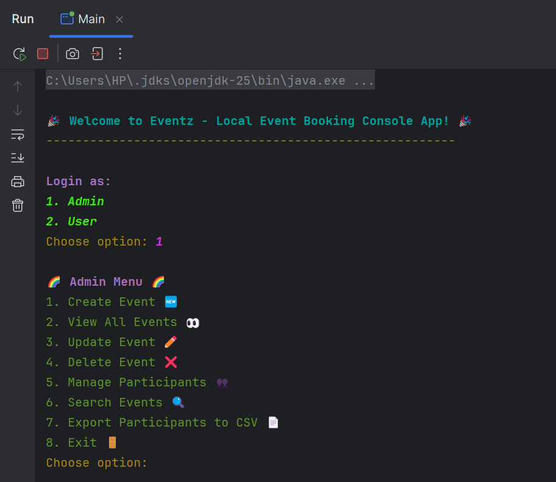
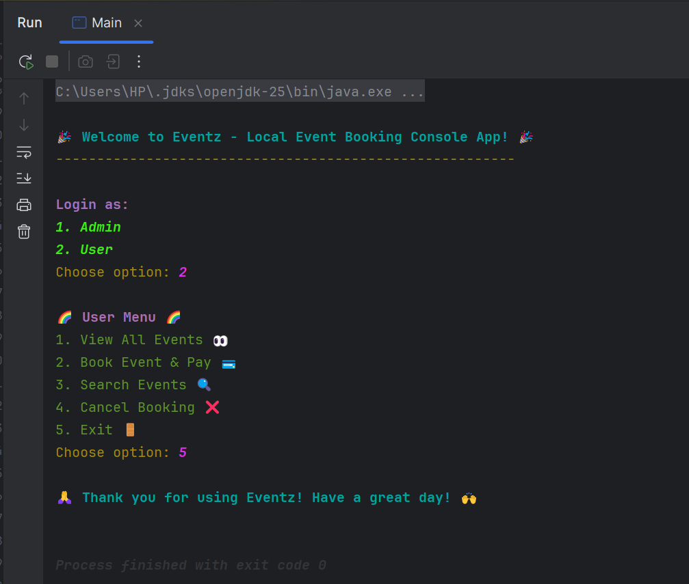
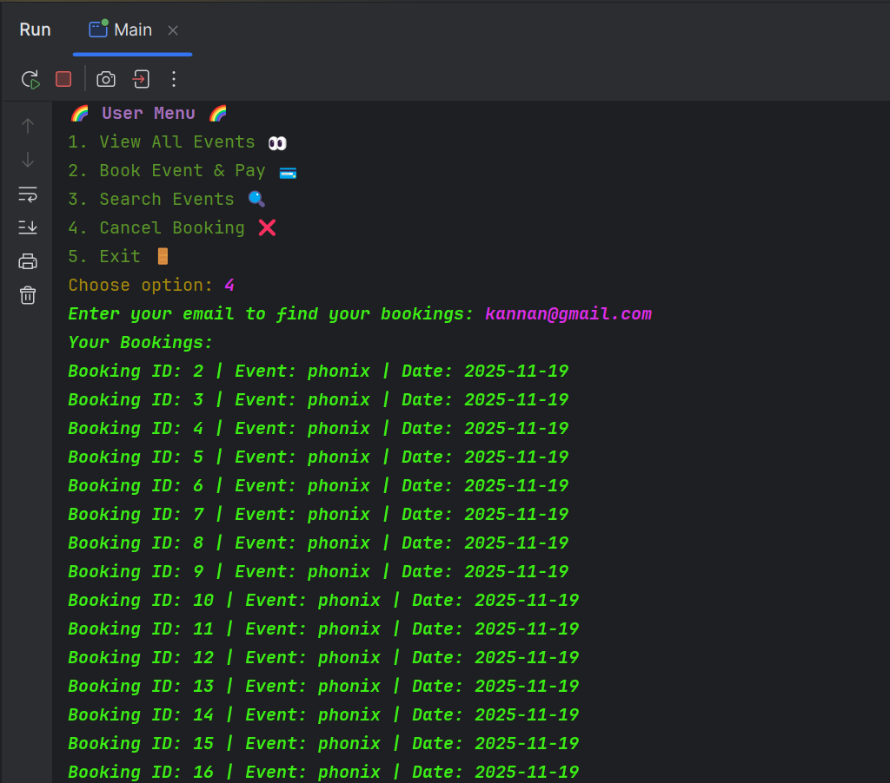
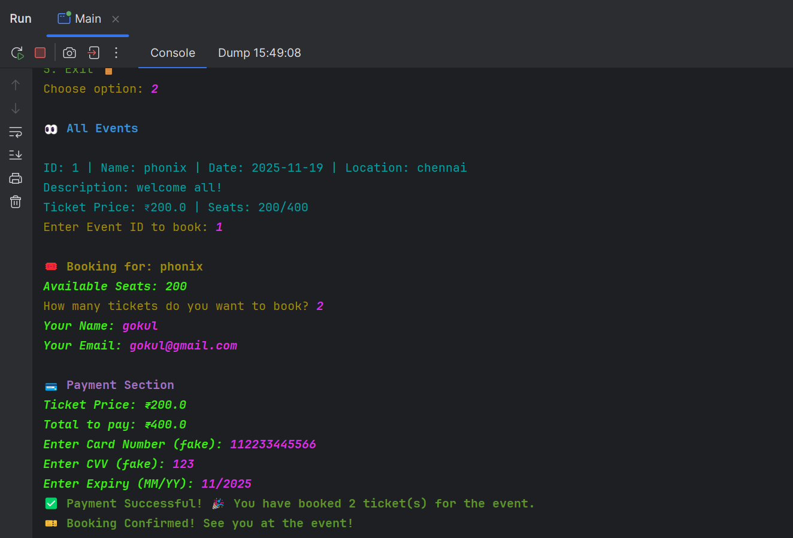

# 🎉 Eventz - Local Event Booking Console App 🎟️

A colorful, emoji-rich Java console application for booking and managing local event tickets with MySQL database.

---

## ✨ Features

- 👑 Admin & 👤 User login (role-based menu)
- 🆕 Create, update, delete, view events (Admin)
- 💰 Set ticket price & seat limit
- 🏷️ Book multiple tickets (with payment simulation)
- 📧 Email validation
- 🔍 Search events (by name, date, location)
- 📄 Export participants to CSV
- ❌ Cancel booking
- 🎨 Colorful console output & 😃 emoji support

---

## 📝 Project Overview

Ithu oru Java console application. Namma local events (music, sports, seminar, etc.) manage panna, ticket book panna use pannalaam.  
Ella data-um MySQL database la store aagum. Output la colorum, emoji-um use pannirukken.  
Admin & User mode irukku.

---

## 📸 Screenshots

> **Add your screenshots in a `screenshots/` folder and link here. Example:**






---

## ▶️ Demo Video

> **Add your demo video link here (Google Drive, YouTube, etc.):**

[Watch Demo Video](https://your-demo-link-here)

---

## 🛠️ Requirements

- Java JDK 11 or above (Java 17/21/25 supported)
- MySQL Server
- Hibernate ORM JARs
- MySQL Connector/J (JDBC driver)
- JAXB, Activation, ANTLR, log4j JARs

---

## 🚦 Setup Instructions

1. **Clone or Download the Project**
   - `git clone https://github.com/yourusername/eventz-booking-app.git`
   - Or download the ZIP and extract.

2. **Database Setup**
   - Open MySQL Workbench or command line.
   - Create the required tables for events and participants (see code for structure).

3. **Download Required JARs**
   - Hibernate (lib/required)
   - MySQL Connector/J
   - javax.persistence-api, javax.transaction-api
   - jaxb-api, jaxb-core, jaxb-impl
   - jakarta.activation-api
   - antlr-2.7.7.jar
   - log4j-1.2.17.jar (optional, for log suppression)

4. **Open Project in IntelliJ IDEA (or any Java IDE)**
   - Open the project folder.
   - Add all Java files (`src/`), `hibernate.cfg.xml`, and JARs.

5. **Add JARs to Project**
   - File > Project Structure > Modules > Dependencies.
   - Click +, select JARs or directories.
   - Add all downloaded JARs.

6. **Update Database Credentials**
   - In `hibernate.cfg.xml`, update:
     ```xml
     <property name="hibernate.connection.username">root</property>
     <property name="hibernate.connection.password">your_password</property>
     ```

7. **Run the Application**
   - Right-click on `Main.java` and select Run.
   - Or use the green play button in IntelliJ.

8. **(Java 11/17/21/25) Add VM Options:**
   --add-opens java.base/java.lang=ALL-UNNAMED -Dcom.sun.xml.bind.v2.bytecode.ClassTailor.noOptimize=true

## 💡 How to Use

- 👑 **Admin**: Login as admin (option 1), manage events, export participants, etc.
- 👤 **User**: Login as user (option 2), view/search events, book tickets, cancel booking.
- 🏷️ **Book Tickets**: Select event, enter number of tickets, pay (simulation), get confirmation.
- 📄 **Export**: Admin can export participants to CSV.
- ❌ **Cancel**: User can cancel their booking by email/booking ID.

---

## 📝 Extra Notes

- Run in a terminal/IDE that supports color & emoji (IntelliJ, VSCode, Windows 10/11, Mac, Linux).
- For log suppression, add `log4j.properties` and `log4j-1.2.17.jar`.
- If you get DB connection error, check MySQL is running, tables created, username/password correct, JARs added.

---

## 🙏 Credits

- Developed by [GOKULAKANNAN S]
- Inspired by real-world event management needs

---

## 📧 Contact

For any queries or suggestions, open an issue or contact [gokulakannan31543@gmail.com].

---

**All the best! 😊**  
**Happy Coding! 🚀**
